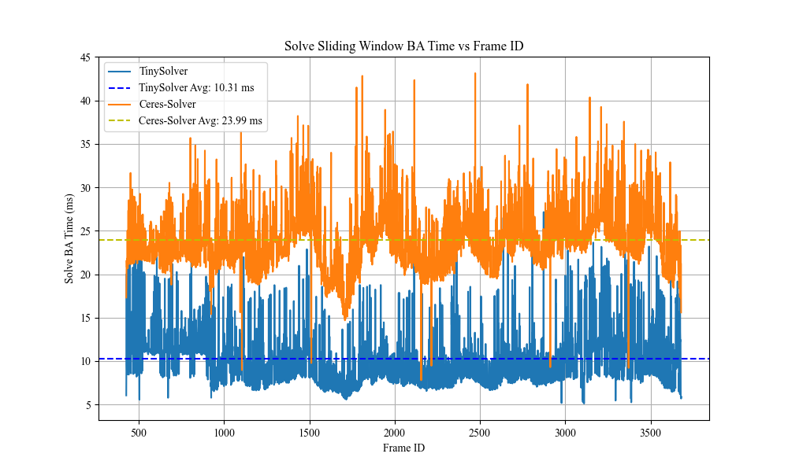
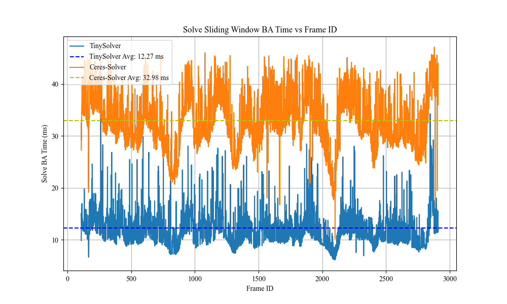

# TinySolver: Visual-Inertial Bundle Adjustment Implementation

This repository contains the implementation of a Visual-Inertial Bundle Adjustment (VIO) algorithm. The algorithm is trying to replace the general Bundle Adjustment (BA) algorithm such as [ceres-solver](https://github.com/ceres-solver/ceres-solver) or [g2o](https://github.com/RainerKuemmerle/g2o).

Now this repository is still under development. Next step is to totally comapre it with more other implementations (g2o, gtsam, et.al)

The version with VIO capability will not release at present but you can try to implement it by yourself. The VIO capability is based on the [XRSLAM](https://github.com/openxrlab/slamtool)

Overall, this repository implements the following constraint objectives:

$$
\min_{\mathcal{X}}
\left(
\sum_{(i,j)\in \mathcal{C}}
\left \| \mathbf{r}^{\text{vis}}_{ij} \right\|^2_{\mathbf{\Sigma}^{-1}_{ij}}
+
\sum_{k}
\left\| \mathbf{r}^{\text{imu}}_{k,k+1} \right\|^2_{\mathbf{\Sigma}^{-1}_{k}}
+
\left\| \mathbf{r}^{\text{prior}} \right\|^2_{\mathbf{\Sigma}^{-1}_{\text{prior}}}
\right)
$$

### Performance

Currently, I have conducted an initial comparison with the version of the optimizer implemented using Ceres in a VIO system. On the EuRoC dataset, it achieves slightly better accuracy and takes only half the computation time compared to Ceres-solver.

  
  

  
  

    Ceres-Solver
    TinySolver
  

In this comparison, the entire system is single-threaded, where feature tracking needs to be completed first, followed by sliding-window BA optimization, we show the sequence MH01 with x5 speed up. This differs from the ROS-based VINS-Mono.